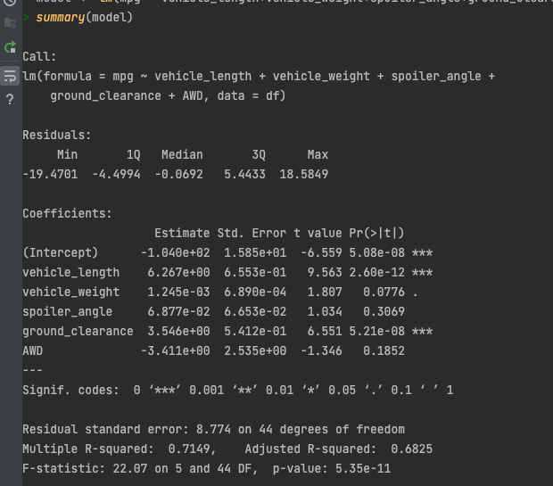
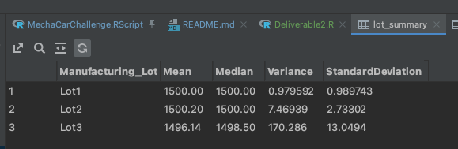

# MechaCar Statistical Analysis

## Linear Regression to Predict MPG

According to the Coefficients produced by the summary, the following attributes provided significant impact on variance:
* vehicle_weight
* spoiler_angle
* AWD

each were greater than .05

Slope of linear model is negative, not zero.

Does this linear model predict mpg of MechCar prototypes effectively?  
Yes, The adjusted R-squared value is .6825 which suggests the model is more accurate that it is not.

## Summary Statistics on Suspension Coils

**_The design specifications of the MechaCar suspension coils dictate that the variance of the suspension coils must not exceed 100 pounds per square inch.  Does the current manufacturing data meet this design specification for all manufacturing lots in total and each lot individually?_** 
The specs call for a variance of no greater that 100 PSI, I measured a variance of 62.2936.  So we're good, for the most part. 
Something is going on with Lot3, it had a variance of > 170, which isn't to spec.  Something might going wrong with the manufacturing process with that one.

