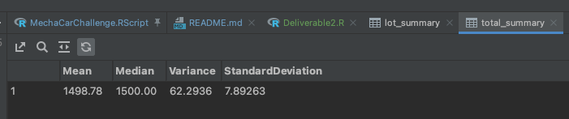

# MechaCar Statistical Analysis

## Linear Regression to Predict MPG

According to the Coefficients produced by the summary, the following attributes provided significant impact on variance:
* vehicle_weight
* spoiler_angle
* AWD

each were greater than .05

Slope of linear model is negative, not zero.

Does this linear model predict mpg of MechCar prototypes effectively?  
Yes, The adjusted R-squared value is .6825 which suggests the model is more accurate that it is not.

## Summary Statistics on Suspension Coils

**_The design specifications of the MechaCar suspension coils dictate that the variance of the suspension coils must not exceed 100 pounds per square inch.  Does the current manufacturing data meet this design specification for all manufacturing lots in total and each lot individually?_** 
The specs call for a variance of no greater that 100 PSI, I measured a variance of 62.2936.  So we're good, for the most part. 
Something is going on with Lot3, it had a variance of > 170, which isn't to spec.  Something might going wrong with the manufacturing process with that one.

## T-Tests on Suspension Coils

**Briefly summarize your interpretation and findings for the t-test results**
Lot3 continues to look fishy.  Their mean is off a bit.  While the other lots have a solid mean of 1500 or vary near it.  
Also, their p-value is below .05, solidly in "reject null hypothesis" land.
Pretty damning evidence that Lot3 is not doing the job well.

## Study Design: MechaCar vs Competition

**Design a statistical study to compare performance of the MechaCar against others.**

In order to make comparisons we'll need similar data on vehicles made by other makers that is similar to the data we have.  Then we could use a two-sample t-test for comparison.

**What metrics are you going to test?**
In looking at the data we have, mpg stands out.  It might be good to see how much of an impact spoiler_angle and vehicle_weight make for others.

**What is the null hypothesis or alternative hypothesis?**
spoiler angle and weight make a direct impact on mpg.  MPG is about the same for similarly weighted cars.

**What statistical test would you use?**
Two-sample t-test

**What data is needed?**
Same as in MechaCar_mpg.csv